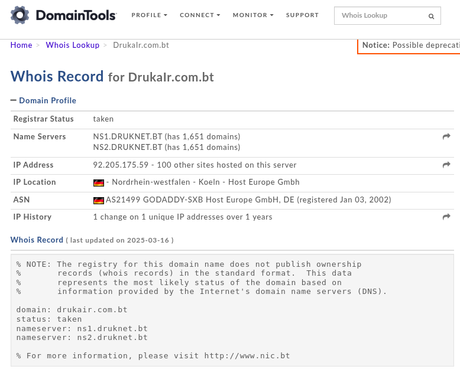
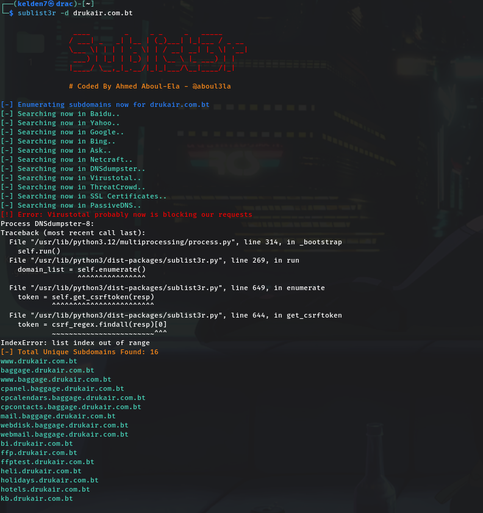
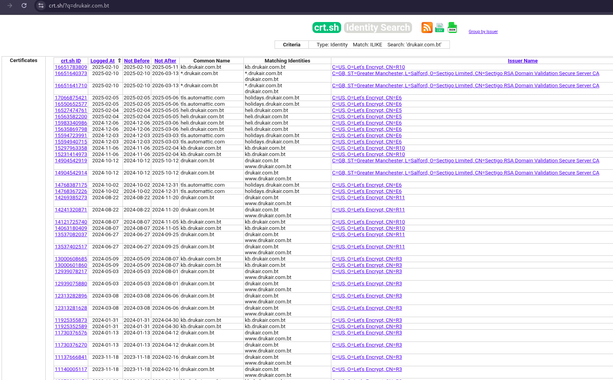
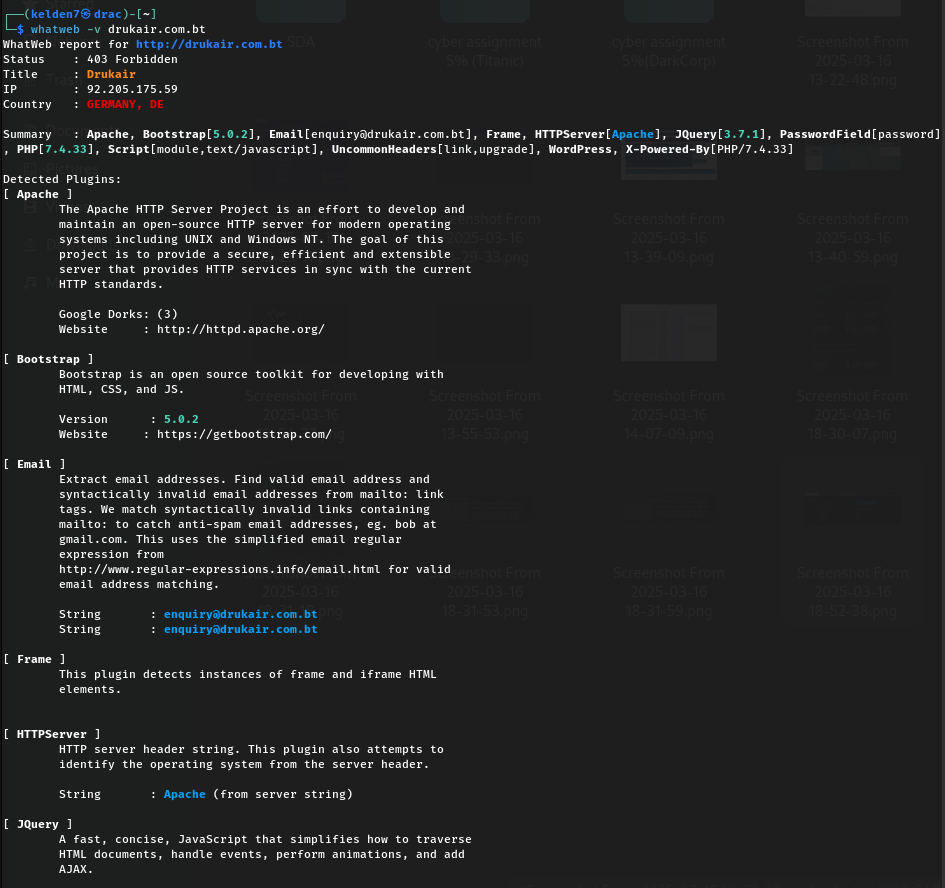
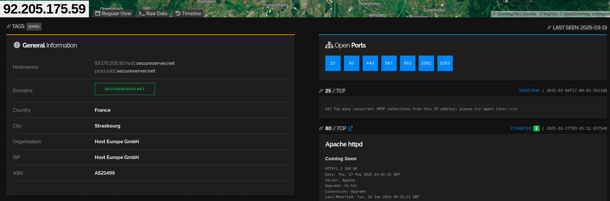
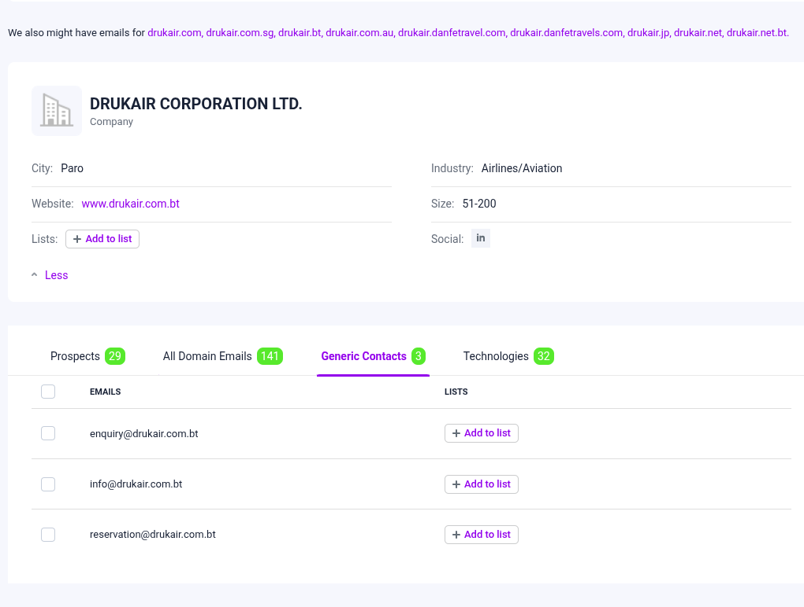
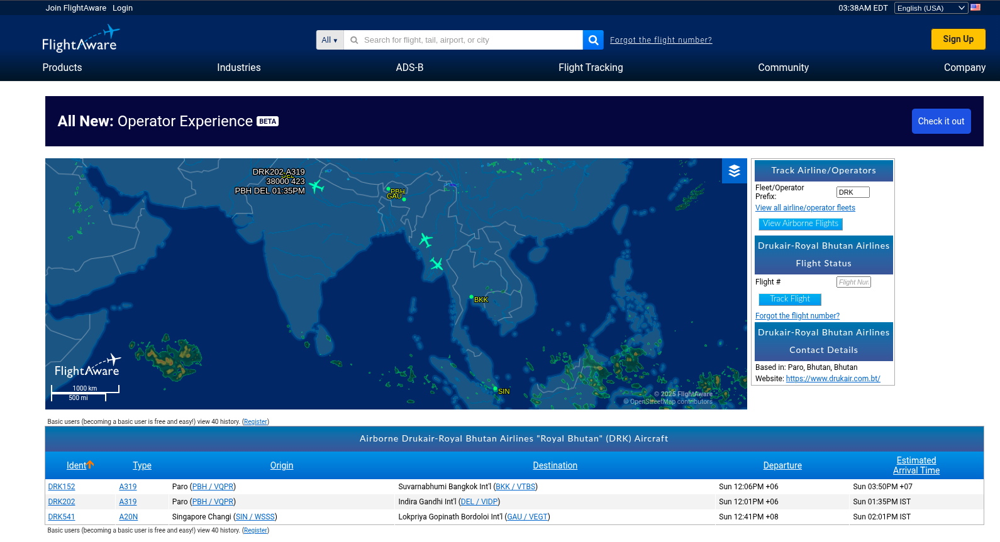
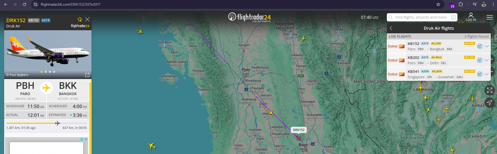

# **1. Introduction**

Drukair, officially known as **Drukair Corporation Limited**, is the national airline of Bhutan, connecting the remote Himalayan kingdom to major cities across South Asia and beyond. Established in 1981 by royal decree, Drukair plays a vital role in Bhutan’s economy by facilitating tourism, trade, and government travel. Operating under the domain drukair.com.bt, the airline provides domestic and international flight services, connecting Bhutan to regional hubs. As a state-owned enterprise, Drukair also offers baggage tracking, holiday packages, hotel bookings, and helicopter services.

This report investigates the online footprint and infrastructure of drukair.com.bt, assessing potential security risks based on publicly accessible information.

# **2. Domain & Infrastructure Information**

### **2.1 Domain & Company Information**

Tool Used: [Whois Lookup](https://whois.domaintools.com/drukair.com.bt)

**Findings:**

- **Domain:** drukair.com.bt
- **Registrar Status:** Taken
- **Hosting Provider:** Host Europe GmbH (Germany)
- **IP Address:** 92.205.175.59
- **ASN:** AS21499 (GoDaddy-SXB, Germany)
- **Name Servers:**
    - ns1.druknet.bt (202.144.128.200)
    - ns2.druknet.bt (202.144.128.210)

### **2.2 DNS Records Analysis**

**Tools Used:** dig, nslookup, dnsenum

- **Mail Exchange (MX) Records:**
    - ASPMX.L.GOOGLE.com (74.125.24.27)
    - ALT1.ASPMX.L.GOOGLE.com (108.177.98.26)
    - ALT2.ASPMX.L.GOOGLE.com (142.250.141.26)
    - ASPMX2.GOOGLEMAIL.com (108.177.98.27)
- **Class C Network Ranges:**
    - 92.205.175.0/24
    - 119.2.100.0/24
- **DNS Zone Transfers:** Attempted but failed (Connection timed out)

# **3. Subdomain Enumeration**

### **3.1 Discovered Subdomains**

**Tools Used:** sublist3r, dnsenum, crt.sh, DNSDumpster

| **Subdomain** | **IP/Details** | **Purpose** |
| --- | --- | --- |
| [www.drukair.com.bt](http://www.drukair.com.bt/) | 92.205.175.59 (Germany) | Main website |
| baggage.drukair.com.bt | Hosted in the U.S. (Namecheap) | Baggage tracking |
| bi.drukair.com.bt | Listed in sublist3r | Business intelligence |
| ffp.drukair.com.bt | Listed in sublist3r | Frequent flyer program |
| ffptest.drukair.com.bt | Listed in sublist3r | Test environment for FFP |
| heli.drukair.com.bt | Listed in sublist3r | Helicopter services |
| holidays.drukair.com.bt | Hosted in the U.S. (Automattic) | Holiday packages |
| hotels.drukair.com.bt | Hosted in the U.S. (SoftLayer) | Hotel bookings |
| kb.drukair.com.bt | Hosted in Bhutan (Bhutan Telecom) | Knowledge base |
| agent.drukair.com.bt | 119.2.100.104 | Travel agent portal |
| ftp.drukair.com.bt | CNAME to [www.drukair.com.bt](http://www.drukair.com.bt/) | FTP server |

### **3.2 SSL Certificate Analysis**

**Tools Used:** crt.sh

- **Main Domain Certificate:**
    - Issued To: *.prod.sxb1.secureserver.net
    - Issuer: Starfield Secure Certificate Authority - G2
    - Validity: Mar 10, 2025 - Apr 11, 2026
    - Subject Alternative Names: *.prod.sxb1.secureserver.net, prod.sxb1.secureserver.net
- **Other SSL Certificates:**
    - kb.drukair.com.bt: Let's Encrypt certificate (Valid: Feb 10, 2025 - May 11, 2025)
    - holidays.drukair.com.bt: Let's Encrypt certificate (Valid: Feb 5, 2025 - May 6, 2025)

# **4. Web Server & Technology Analysis**

### **4.1 Server Information**

**Tools Used:** whatweb

- **Web Server:** Apache
- **Server Status:** 403 Forbidden
- **Title:** Drukair
- **Hosting Country:** Germany

### **4.2 Technology Stack**

**Tools Used:** Wappalyzer

- **CMS:** WordPress
- **Programming Language:** PHP 7.4.33 (End of life: Nov 2022)
- **JavaScript Frameworks:** Vue.js, jQuery 3.7.1, Bootstrap 5.0.2
- **Databases:** MySQL
- **CDN Services:** Cloudflare, Amazon S3, jsDelivr
- **Marketing Automation:** MailChimp

### **4.3 Server Ports & Services**

**Tools Used:** shodan.io

| **Port** | **Service** | **Details** |
| --- | --- | --- |
| 25/tcp | SMTP | Rate limiting implemented ("Too many concurrent SMTP connections") |
| 80/tcp | HTTP | Apache httpd "Coming Soon" page |
| 443/tcp | HTTPS | Apache httpd "Coming Soon" page |
| 587/tcp | SMTP | Exim smtpd 4.96 |
| 993/tcp | IMAP | Dovecot with SSL |
| 2082/tcp | HTTP | 301 Redirect to port 2083 |
| 2083/tcp | HTTPS | 301 Redirect (cPanel) |

# **5. Email & Employee Intelligence**

### **5.1 Identified Email Addresses**

**Tools Used:** Hunter.io, Snov.io

**Executive Level:**

- Tandi Wangchuk (CEO) - wangchuk@drukair.com.bt
- Sunil Kapoor (Chief Security Officer) - kapoor@drukair.com.bt
- Tashi Yangjay (IT Director) - yangjay@drukair.com.bt

**Customer Service & Operations:**

- Gulshan Dhaka (Sales Agent) - dhaka@drukair.com.bt
- Ngawang Tenzin (Head of Drivers) - tenzin@drukair.com.bt
- Sonam Yangchen (Head of Operations) - yangchen@drukair.com.bt

**Generic Emails:**

- enquiry@drukair.com.bt
- info@drukair.com.bt
- reservation@drukair.com.bt

**Observed Email Pattern:** {last}@drukair.com.bt

Emails such as enquiry@drukair.com.bt and reservation@drukair.com.bt could be targeted for phishing attacks. Employee emails following the pattern `{last}@drukair.com.bt` are predictable, compounding risks.

# **6. Security Assessment**

**Tools Used:**

- **Google Dorking**: `filetype:pdf site:drukair.com.bt`
- **Reviewed**: Drukair’s annual reports and security-related documents.

## **Drukair's Key Vulnerabilities (2017 Report)**

### **Aging Fleet & Maintenance Risks**

- **Old aircraft** (Airbus A319, ATR-42-500) require frequent maintenance, increasing costs.
- **Dependency on foreign repair centers** (Singapore, Paris) risks service disruptions.

### **Financial Strain**

- **High debt (Nu. 1.6B)**, reliance on **government subsidies** for unprofitable routes.
- **Revenue pressure** from competition (Bangkok, Delhi, Kathmandu).

### **Cybersecurity & IT Risks**

- **New booking systems** could be vulnerable to **cyberattacks and data breaches**.
- **Lack of IT security policies**, raising concerns over customer data protection.

### **Regulatory & Legal Issues**

- **Pending royalty dispute (INR 21.7M) with Air India**.
- **Inventory valuation issues** violating Bhutan Accounting Standards (BAS).

## **Drukair's Key Vulnerabilities (2020 Report)**

### **COVID-19 Impact & Financial Struggles**

- **Flights down 71%**, revenue dropped **66.94% (Nu. 1.4B vs. Nu. 4.3B)**.
- **Debt surged 91% (Nu. 5.2B)**, **cash reserves fell to Nu. 68M**.

### **Operational & HR Challenges**

- **Severe cost-cutting**: Maintenance **down 69.8%**, marketing **down 85.4%**.
- **A320 NEO acquired**, increasing financial strain.

### **IT & Cybersecurity Risks**

- **WhatsApp-based ticket booking** during lockdown, raising **security concerns**.
- **No major cybersecurity improvements**, despite new digital payment systems.

### **Regulatory & Compliance Risks**

- **Tax liabilities pending**: Nu. **103M (Bhutan), 7.9M (Bangkok), 566K (Singapore)**.
- **Financial instability risks**, despite audit compliance.

### **6.2 VirusTotal Scan**

**Tools Used:** VirusTotal

- No detected malware or phishing threats.
- Three detected files communicating with the domain (no malicious activity flagged).

# **7. Flight & Operational Data**

### **7.1 Flight Tracking**

**Tools Used:**

- [FlightAware](https://www.flightaware.com/)
- [Flightradar24](https://www.flightradar24.com/)
    
    
    
    
    

**Findings:**

- Drukair operates flights from **Paro International Airport (PBH)**
- Common flight routes: **Bhutan → India, Thailand, Nepal, Singapore**
- Aircraft fleet includes **Airbus A319 and ATR 42-600**

# **8. Conclusions & Recommendations**

### **8.1 Key Findings**

- Drukair's website is hosted on GoDaddy infrastructure in Germany.
- Multiple subdomains expose various internal services.
- Email infrastructure could be targeted for phishing.
- PHP and WordPress must be regularly updated.

### **8.2 Recommendations**

- **Infrastructure Security:** Update PHP, implement WAF, review cPanel access.
- **Domain Security:** Implement DNSSEC, restrict unnecessary subdomain exposure.
- **Web Security:** Regularly update WordPress, remove revealing headers.
- **Service Hardening:** Restrict unnecessary SMTP/IMAP access, use VPN for admin access.
- **Certificate Management:** Ensure certificates match organizational domain names.

### **8.3 Follow-Up Actions**

- Conduct deeper vulnerability scans.
- Monitor domain and certificate changes.
- Regularly review digital footprint.