# Week 1 Machine: DarkCorp

### Windows · Insane

# Introduction

DarkCorp is an "Insane" difficulty machine on HackTheBox that challenges participants to employ advanced reconnaissance, exploitation, and privilege escalation techniques. This walkthrough provides a step-by-step guide to compromising the DarkCorp machine, offering clear explanations suitable for beginners.

# Reconnaissance

## **1. Initial Connectivity Check**

The target machine's availability was verified using the `ping` command:

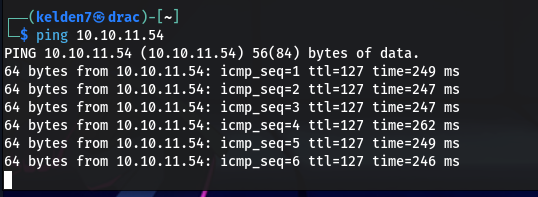

A successful response indicates that the target is reachable.

## **2. Web Server Fingerprinting**

Identify the web server and technologies in use with `whatweb`:

This tool provides insights into the server's software, which can be crucial for identifying potential vulnerabilities.

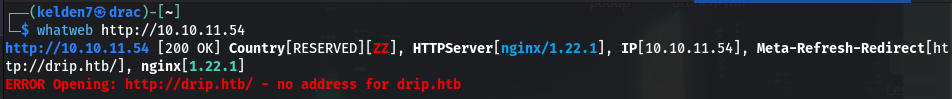

This provided insights into the server's software, which is crucial for identifying potential vulnerabilities.

## **3. Hostname Resolution**

To access services configured with virtual hosts, I updated the /etc/hosts file and pinged again to confirm:

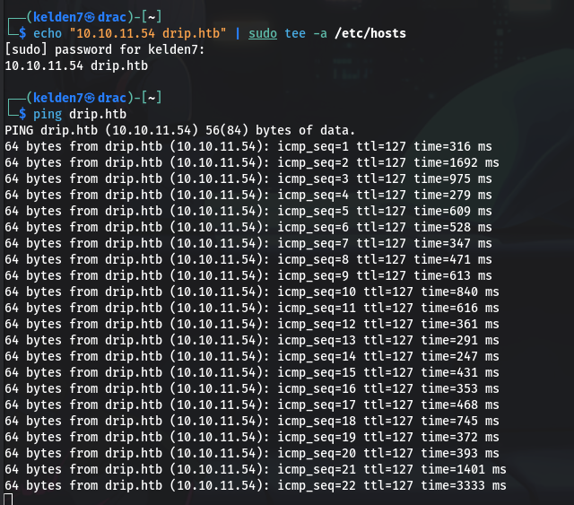

This allowed for proper resolution of the `drip.htb` domain.

## **4. Network Scanning**

An initial `Nmap` scan was conducted to identify open ports and services:

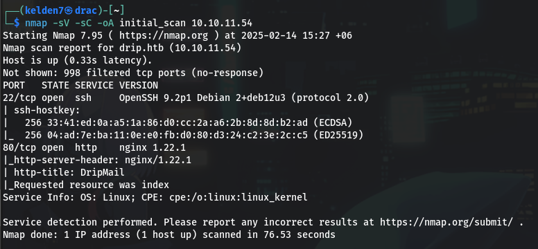

This scan revealed that ports 22 (SSH) and 80 (HTTP) were open.

A comprehensive scan of all ports was also performed:

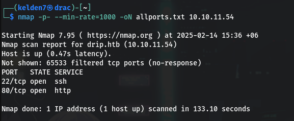

## 5. Directory Enumeration

The `gobuster` tool was employed to discover hidden directories on the web server:

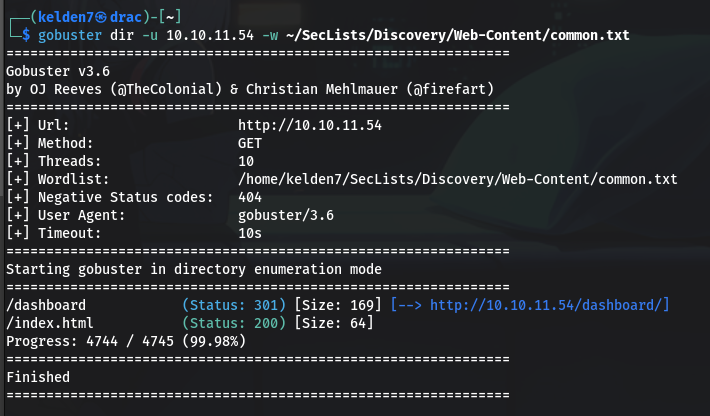

This enumeration uncovered the following directories:

`/dashboard (Status: 301)
/index.html (Status: 200)`

Subsequently, `gobuster` was run against the `drip.htb` domain:

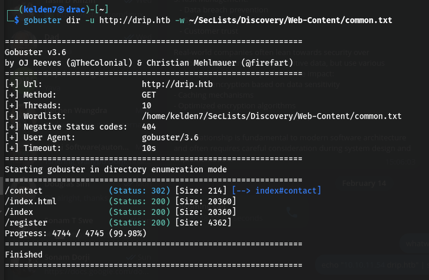

This revealed additional directories:

`/contact (Status: 302)
/index.html (Status: 200)
/index (Status: 200)
/register (Status: 200)`

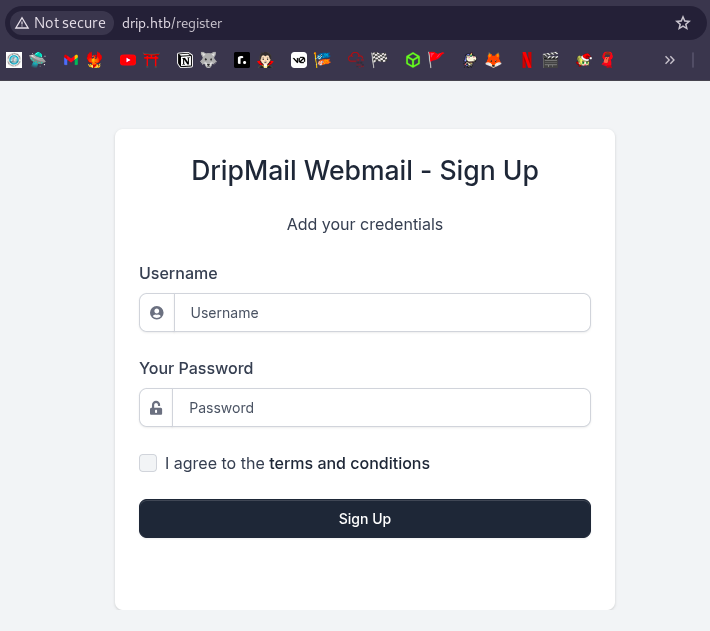

After registering with test credentials, the site redirected to `mail.drip.htb/` and became inaccessible.

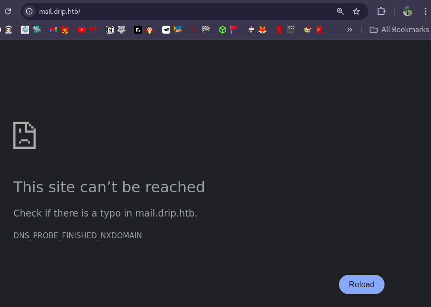

## **6. Subdomain Discovery**

Based on the pattern of subdomains, the `/etc/hosts` file was further updated to include `mail.drip.htb`:

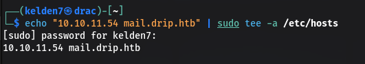

Accessing `mail.drip.htb` presented a login page, indicating the presence of a mail service.

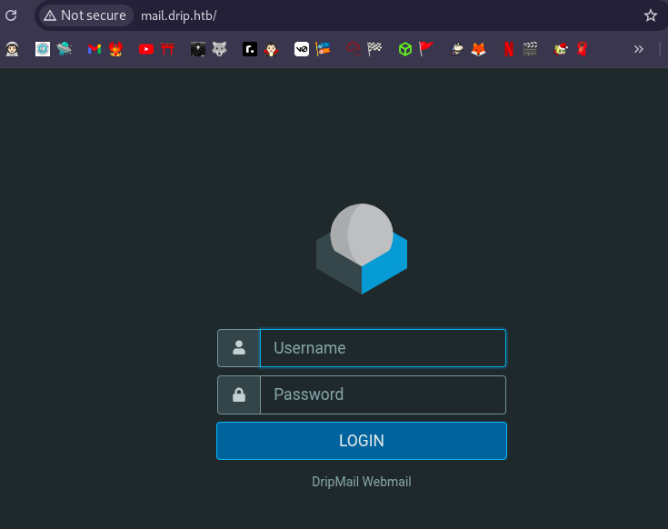

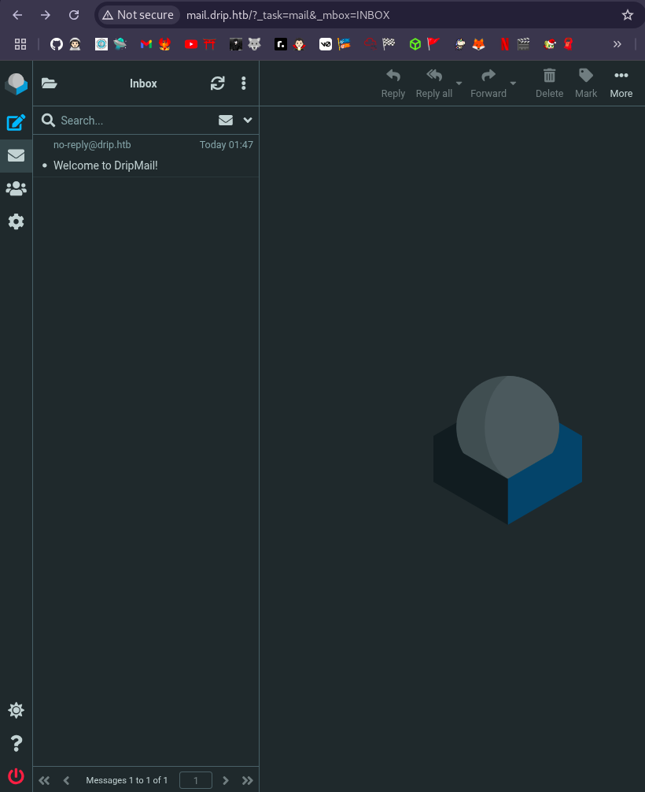

# Exploitation

## Web Application Analysis

The `/register` page on `drip.htb` was examined, which displayed a user registration form. Attempts to register a new user did not yield any immediate leads.

## Service Enumeration

Given the open ports, the following services were probed:

`HTTP (Port 80):`Standard web service hosting the main site.
`SSH (Port 22):`Secure Shell service, typically used for remote administration.

## Vulnerability Assessment

The following tools and techniques were employed to identify potential vulnerabilities:

**Nginx Version Analysis:** The server was identified as running Nginx 1.22.1. Public vulnerability databases were consulted to check for known exploits against this version.

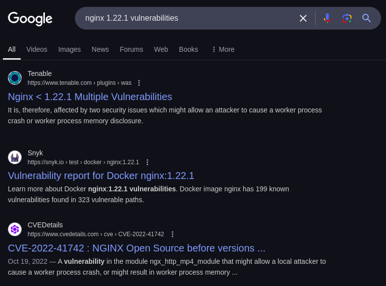

**WAF Detection:** `wafw00f` was used to detect the presence of a Web Application Firewall:

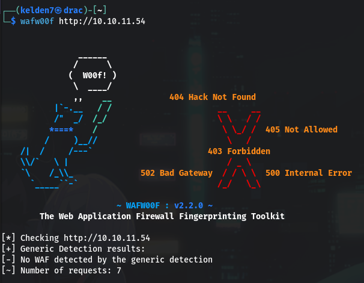

No significant findings were reported.

**SMB Enumeration:** `smbmap` was utilized to check for accessible SMB shares:

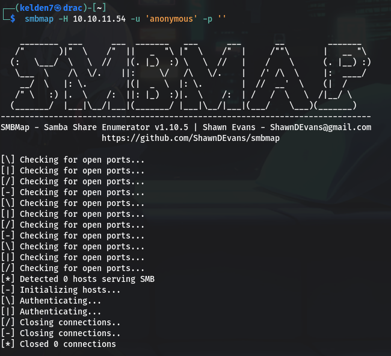

No accessible shares were found.

**SQL Injection Testing:** `sqlmap` was employed to test the `/register` page for SQL injection vulnerabilities:

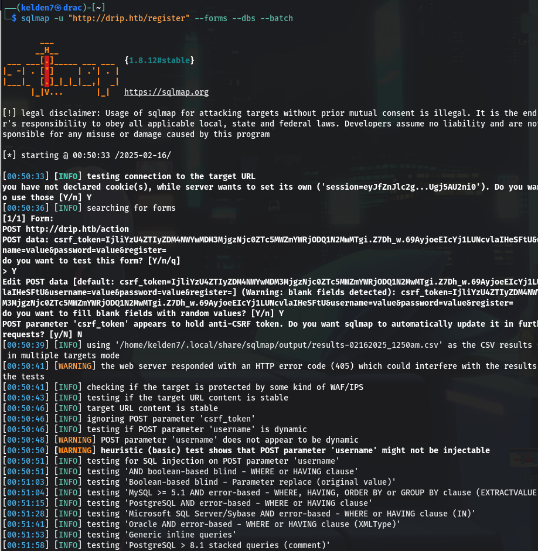

The tests did not reveal any exploitable SQL injection points.

## Privilege Escalation

Since initial exploitation attempts were unsuccessful, additional enumeration and analysis will be required to discover potential misconfigurations or vulnerabilities that could enable privilege escalation.